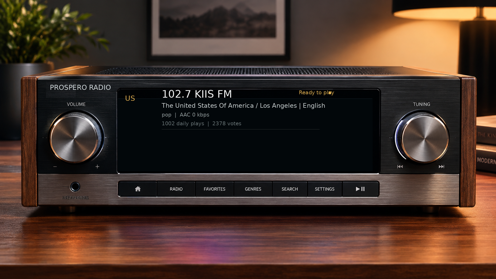
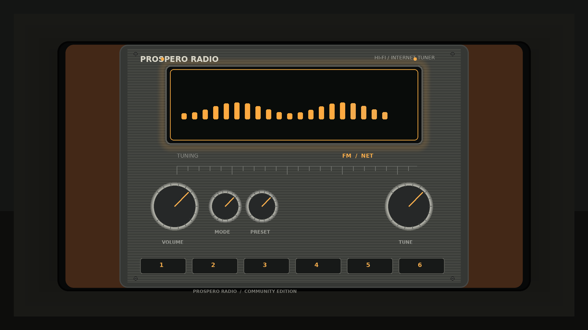
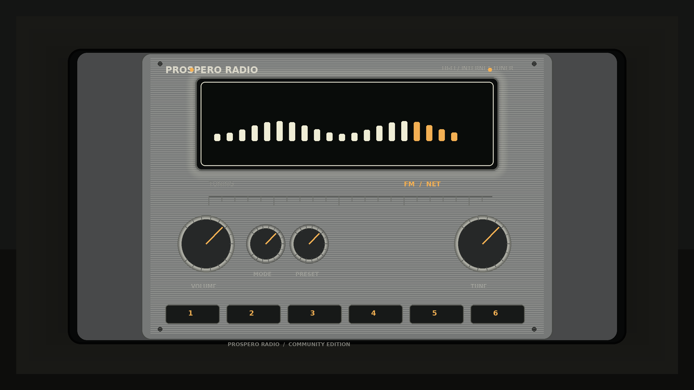
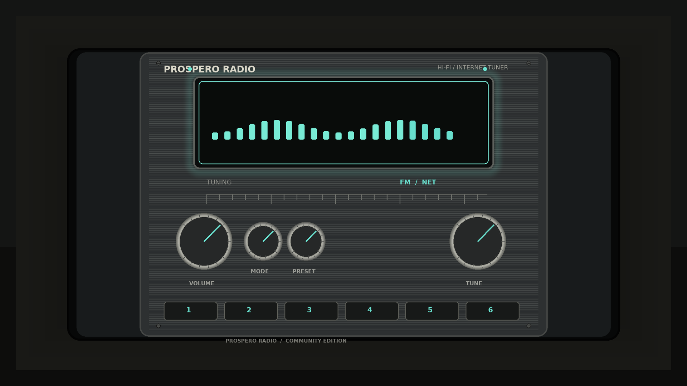

<div align="center">



# 📻 ProsperoRadio Vulkan Edition

**Una radio de internet para PS5 con cara de radio de verdad — renderizada con Vulkan.**


[CHANGELOG](CHANGELOG.md) · [Memoria del proyecto](MEMORIA.md) · [Reportar un problema](https://github.com/RastaFairy/Prospero_Radio_Vulkan/issues)

</div>

---

## ✨ Qué es

ProsperoRadio es una radio de internet para PlayStation 5. Este fork conserva toda su
lógica (emisoras, catálogo, favoritos, streaming) y le cambia dos cosas de fondo:

- **Render 100 % Vulkan** — adiós al dibujado software de SDL: la interfaz pasa por
  [PS5_Vulkan](https://github.com/mihawk-99/PS5_Vulkan) (Mesa → AGC) con salida
  nativa a 4K, 1440p o 1080p según tu televisor.
- **Memoria que aguanta** — un pool propio de Direct Memory de 512 MB para las
  asignaciones grandes, resuelto tras forense de 37 crashes en consola real
  ([toda la historia](MEMORIA.md)).

## 🆕 Última actualización — 01.000.017

> ✅ **Primera versión que arranca y funciona en consola.**
>
> - Pool de Direct Memory (512 MB) para las asignaciones grandes: eliminada la causa
>   de todos los crashes anteriores.
> - Runtime con diagnóstico: log en `/download0/prospero-radio.log` con rastro de
>   asignaciones si algo fallara.
> - Historial completo del diagnóstico: 37 crashes, simbolización de coredumps y
>  culpable final (el heap de libc de la consola no crece) en [MEMORIA.md](MEMORIA.md).

## 🎛️ Funciones

- 📡 **Streaming de radio por internet** — HLS con reconexión, metadatos ICY en vivo.
- 🎵 **Códecs decodificados en consola** — Vorbis, Opus, FLAC, AAC/TS, MP3.
- 🗂️ **Catálogo navegable** — buscador, paginación, favoritos persistentes.
- 🖼️ **Interfaz física de radio** — sintonizador 3×2 de emisoras con tres acabados de
  mueble a elegir.
- 🖥️ **Salida Vulkan** — 4K / 1440p / 1080p automático según VideoOut, fondo maestro
  4K cargado por bloques.
- 🩺 **Diagnóstico integrado** — log fetchable por FTP si algo va mal.

## 🕹️ Controles

| Entrada | Acción |
| --- | --- |
| Stick izquierdo | Volumen |
| Stick derecho | Sintonizar emisora |
| Cruceta ←→ | Cambiar de lista |
| Cruceta ↑↓ | Navegar |
| ✕ | Reproducir / confirmar |
| △ | Ajustes (favoritos, actualización de catálogo) |

Los recursos modulares para foco/pulsación, los 21 overlays de volumen en pasos
de cinco y el tuner digital están descritos en la [guía del atlas](docs/RADIO-CONTROLS-ATLAS.md).
La propuesta híbrida actual y los pasos para integrar sus texturas en Vulkan/RmlUi
están en la [guía de GLM](docs/GLM-TEXTURAS-VULKAN.md); la [vista de la propuesta](docs/RADIO-FRONTAL-HIBRIDO.md)
incluye sus previsualizaciones.

## 🪵 Temas

<div align="center">
  
<p><sub>Nogal · Plateado · Grafito</sub></p>
</div>

## 📦 Instalación

1. Descarga `PPSA99001.ffpfsc` (o `.ffpkg`) desde la sección
   [Releases](https://github.com/RastaFairy/Prospero_Radio_Vulkan/releases).
2. Instálalo con tu loader habitual (etaHEN) y lánzalo desde la pantalla principal.

## 🔨 Compilar

Requiere Windows 11 + WSL2 (Ubuntu 24.04):

```powershell
.\build.ps1            # PowerShell
# o
bash ./build.sh packages
```

Genera `out/PPSA99001/eboot.bin`, `PPSA99001.ffpkg` y `PPSA99001.ffpfsc`. El detalle
del pipeline (driver estático, PSBC, Mesa, shaders SPIR-V, empaquetado UFS2) está en
la [memoria del proyecto](MEMORIA.md).

## 🙏 Agradecimientos

Este fork se apoya en el trabajo de mucha gente:

| Proyecto / autor | Aporta |
| --- | --- |
| [blackbearreloaded](https://github.com/blackbearreloaded/ProsperoRadio) | **ProsperoRadio** original y el tooling nativo del título |
| [mihawk-99](https://github.com/mihawk-99/PS5_Vulkan) | **PS5_Vulkan** — el driver Vulkan para PS5 |
| [Mesa3D](https://www.mesa3d.org/) | Compiladores de shaders (ACO/NIR) y el núcleo del driver |
| [mikke89](https://github.com/mikke89/RmlUi) | **RmlUi** — la interfaz en la que vive la radio |
| [SDL](https://github.com/libsdl-org/SDL) | Mandos y temporización |
| [Sean Barrett](https://github.com/nothings/stb) — stb | `stb_vorbis` |
| [David Reid](https://github.com/mackron/dr_libs) — dr_libs | `dr_flac` |
| [PSBrew](https://github.com/PSBrew/MkPFS) — MkPFS | Empaquetado PFS/PFSC |
| [LightningMods](https://github.com/LightningMods) — etaHEN | Entorno de carga y depuración en consola |
| Montserrat · DejaVu · Noto Sans · Source Han Sans | Tipografías bitmap multilingües |

Y a la escena de PS5 en general, por hacer posible ejecutar cosas así.

---

<div align="center">
<sub>Este proyecto respeta la licencia <b>GPL-3.0</b> del ProsperoRadio original — cualquier mejora vuelve a la comunidad.</sub>
</div>
