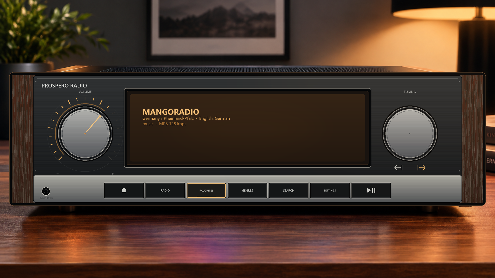

<div align="center">



# Prospero Radio Vulkan

Radio por internet para PS5 con una interfaz inspirada en un receptor clásico.


[Cambios](CHANGELOG.md) · [Pendientes](docs/PENDIENTES.md) · [Integración Vulkan](VULKAN-INTEGRATION.md) · [Problemas](https://github.com/RastaFairy/Prospero_Radio_Vulkan/issues)

</div>

---

## Estado actual

La versión fuente y el paquete local más reciente son **01.000.042**. El paquete
FFPFSC se generó correctamente y superó el gate de recursos. Las capturas recibidas
el 28-09-2026 muestran la v042 ejecutándose en una PS5: aparece una emisora y se
puede abrir la lista AUX M3U. Es una validación parcial; no se cotejó el hash del
paquete instalado y no certifica todas las funciones.

En esa prueba siguen observándose etiquetas de fuente superpuestas o vacías, el
estado `JACK N/A` al conectar el mando, y el usuario reporta que una lista M3U
reenviada puede duplicar emisoras ya importadas. En la página web AUX, el subtítulo
superior pierde contraste hacia la derecha. Estos puntos están registrados en
[`docs/PENDIENTES.md`](docs/PENDIENTES.md); no se han corregido en esta publicación.

## Qué aporta este fork

- Renderer Vulkan integrado con el frontend RmlUi; SDL sigue atendiendo entrada y
  temporización.
- Interfaz de radio con catálogo, búsqueda, favoritos, metadatos del stream y controles
  visuales basados en texturas.
- Integración del driver Vulkan y sus herramientas mediante `overlay/`, aplicada a un
  commit upstream fijado en el build.
- Herramientas para producir la fachada y los atlas en
  [`docs/RADIO-CONTROLS-ATLAS.md`](docs/RADIO-CONTROLS-ATLAS.md).
- Puente de persistencia en `/data/radio` y servidor de importación M3U por
  payload; el protocolo y sus límites están en
  [`docs/PUENTE-PAYLOAD.md`](docs/PUENTE-PAYLOAD.md).

La salida se calcula a partir del modo activo de VideoOut. La presentación final en
4K, 1440p y resoluciones dinámicas requiere validación en consola.

## Compilar

En Windows 11, instala WSL2 con Ubuntu 24.04 y ejecuta desde PowerShell:

```powershell
.\build-vulkan.ps1 -Mode ffpfsc
```

También puedes ejecutar `bash ./build.sh ffpfsc` desde Ubuntu/WSL. `ffpfsc` produce
la imagen comprimida; `app` compila y copia el directorio de la aplicación; `check`
ejecuta el objetivo de comprobación del proyecto y `clean` limpia el build upstream
aislado. `packages` se conserva como alias heredado de `ffpfsc`.

El build aplica `overlay/apply-vulkan.py` sobre el commit upstream fijado y conserva
la caché fuera del repositorio. Los resultados locales van a `out/`; no se deben
subir paquetes, dumps de consola, SDK ni dependencias descargadas. Consulta
[`VULKAN-INTEGRATION.md`](VULKAN-INTEGRATION.md) para conocer el flujo y sus límites.

## Distribución

Esta rama está en desarrollo y la v042 tiene validación parcial en hardware. El
paquete local pesa 52,887,552 bytes (SHA-256
`7C515C6EC3214429264E678B0E30391C370DA4F3E41048B863176A351051D3D7`). El sello de
pantalla confirma la versión mostrada, pero no identifica por sí solo el hash
instalado. No se distribuye aquí el paquete: los artefactos y logs de `out/` son
locales. Consulta [`CHANGELOG.md`](CHANGELOG.md) y
[`docs/PENDIENTES.md`](docs/PENDIENTES.md) para la evidencia y lo que falta.

## Estructura principal

| Ruta | Uso |
| --- | --- |
| `overlay/` | Parches, renderer, UI y recursos que consume el build Vulkan aislado. |
| `src/`, `include/`, `tooling/`, `vendor/` | Código y dependencias conservados del árbol base del proyecto. |
| `assets/ui/` | Recursos fuente del árbol del proyecto; los recursos del build overlay viven en `overlay/assets/ui/`. |
| `docs/` | Diseño de la interfaz, integración, pruebas y lista de trabajo pendiente. |
| `out/` | Builds, logs y evidencias locales; ignorados por Git salvo herramientas expresamente mantenidas. |

## Licencia y créditos

Este fork deriva de [ProsperoRadio de blackbearreloaded](https://github.com/blackbearreloaded/ProsperoRadio)
y conserva su licencia GPL-3.0-or-later. La integración gráfica usa
[PS5_Vulkan](https://github.com/mihawk-99/PS5_Vulkan), Mesa, RmlUi y SDL. Consulta
`LICENSE` y los avisos de terceros incluidos en el repositorio para las condiciones
de redistribución de cada componente.
