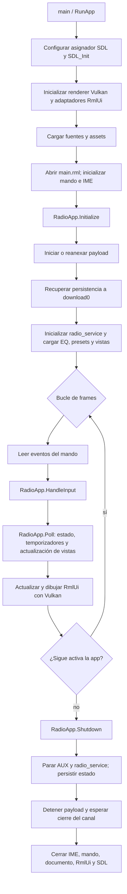
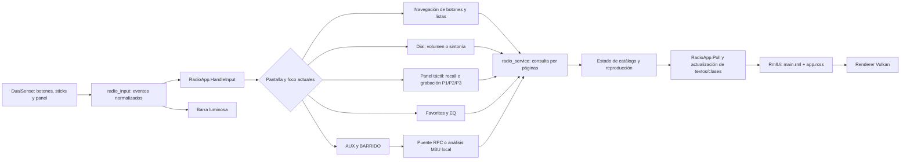
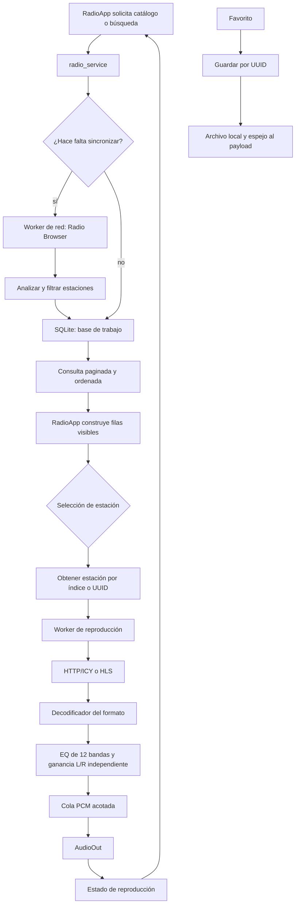
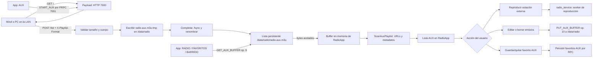
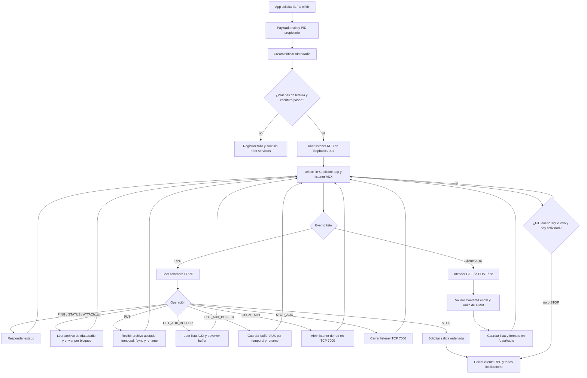

# Flujos de funcionamiento por módulos

Este documento separa los recorridos de la app y del payload en diagramas pequeños. Describe el **código fuente del checkout correspondiente a v046**: `overlay/` sustituye o modifica piezas del árbol upstream durante el build. La build pasó el gate y el usuario probó la v046 en PS5, pero estos diagramas no certifican cada ruta ni cada formato.

## Mapa de módulos

### App principal

- **Arranque y render:** `src/main.cpp`, transformado por [`overlay/apply-vulkan.py`](../overlay/apply-vulkan.py), configura SDL/RmlUi, carga el documento y presenta los frames mediante [`overlay/src/ps5_vulkan_renderer.cpp`](../overlay/src/ps5_vulkan_renderer.cpp).
- **Interfaz y navegación:** [`overlay/src/radio_app.cpp`](../overlay/src/radio_app.cpp) gestiona pantallas, foco, listas, búsqueda, favoritos, EQ, AUX, presets y estado visible. El documento y los estilos están en [`overlay/assets/ui/main.rml`](../overlay/assets/ui/main.rml) y `overlay/assets/ui/styles/app.rcss`.
- **EQ:** usa la superficie `screen-eq` existente: 12 bandas y dos faders de canal L/R. El dial derecho recorre los controles; el izquierdo modifica el seleccionado. Los presets solo cambian las bandas.
- **Entrada del mando:** el código de `radio_input` recibe botones, sticks y panel táctil; traduce eventos para `RadioApp` y controla la barra luminosa desde el parche aplicado por `overlay/apply-vulkan.py`.
- **Catálogo y audio:** `radio_service` consulta el catálogo SQLite y coordina sincronización y reproducción en segundo plano. La ruta de audio decodifica el stream, aplica EQ y entrega PCM a AudioOut.
- **Puente de persistencia:** [`overlay/src/payload_probe.cpp`](../overlay/src/payload_probe.cpp) inicia o reanexa el ELF y transfiere la lista AUX como bytes en memoria mediante RPC; catálogo, EQ y otras preferencias mantienen copias de trabajo locales.
- **Servidor AUX:** el navegador envía una lista al puerto 7000 del payload; la app recupera los bytes por RPC a memoria, los analiza y los muestra como fuente AUX. La lista AUX no se materializa en `/download0`.

### Payload

- **Inicio y comprobación de almacenamiento:** [`overlay/payloads/prospero_radio_data_bridge.c`](../overlay/payloads/prospero_radio_data_bridge.c) valida `/data/radio` y las operaciones de lectura/escritura antes de abrir los servicios.
- **Control RPC:** un listener local en `127.0.0.1:7001` recibe el protocolo `PRPC` para estado, transferencia de ficheros y ciclo de vida de AUX.
- **Persistencia:** GET/PUT mueve archivos identificados por ID; las escrituras se publican desde un temporal tras recibir los datos completos.
- **Servidor de listas:** el puerto TCP 7000 se abre bajo petición de la app, atiende la página AUX y recibe `POST /list`.
- **Cierre:** la orden `STOP`, la desaparición del proceso propietario o el tiempo de inactividad terminan el bucle y liberan los sockets.

## 1. Ciclo de vida de la app

**Detalle del cierre:** el código generado realiza el cierre ordenado al salir del bucle. El `main()` del árbol base termina llamando a `KeepProcessAlive()` después de `RunApp`; por eso el retorno de `RunApp` no demuestra que el proceso haya terminado. La conducta final debe cotejarse con el artefacto generado y el cierre observado en consola.

## 2. Mando, estado de interfaz y reproducción

La detección del jack queda fuera del alcance: el flujo de entrada no consulta el conector y la interfaz no muestra un estado de auriculares. Las capturas históricas de v042 que muestran `JACK N/A` corresponden a una versión anterior del código.

## 3. Catálogo y audio

La consulta de páginas limita lo que se materializa para la interfaz; la reproducción y la sincronización trabajan fuera del bucle de render. Al detener o cambiar de estación, el servicio cancela la lectura activa y descarta el PCM pendiente.

## 4. Importación AUX M3U hasta la reproducción

La fuente incluye lectores para M3U/M3U8, PLS, XSPF y ASX, y filtra URLs duplicadas dentro de una lista. La petición identifica el formato mediante `X-Playlist-Format`; el payload persiste contenido y tipo con el nombre fijo `radio-aux.m3u`. La lista AUX pasa por buffers de memoria en las operaciones RPC 9/10, con límite de 4 MiB, y no usa `/download0/radio-aux.m3u`. No se ha validado en PS5 una matriz de formatos, codificación, metadatos ni URLs relativas. Reimportar reemplaza el fichero persistente; el upload no prueba que cada URL pueda reproducirse.

## 5. Payload: arranque, RPC, AUX y cierre

El payload usa un solo bucle `select` para RPC y AUX. La atención de un cliente HTTP ocurre dentro de ese bucle, por lo que una conexión lenta puede retrasar momentáneamente otras operaciones; el mapa refleja el código, no valida esa latencia en consola.

## Fuentes principales por módulo

- App y ciclo de vida: [`src/main.cpp`](../src/main.cpp), [`overlay/apply-vulkan.py`](../overlay/apply-vulkan.py), [`overlay/src/app_cpp_runtime.cpp`](../overlay/src/app_cpp_runtime.cpp).
- Control, pantallas y persistencia visual: [`overlay/src/radio_app.cpp`](../overlay/src/radio_app.cpp), [`overlay/include/radio_app.hpp`](../overlay/include/radio_app.hpp).
- Mando: `src/radio_input.cpp` más `patch_controller_input()` y `patch_v027_radio_features()` en `overlay/apply-vulkan.py`.
- Servicio y catálogo: `src/radio_service.cpp`, `src/radio_catalog_store.cpp` y `patch_audio_service()` / `patch_catalog_paging()` en `overlay/apply-vulkan.py`.
- RPC cliente: [`overlay/src/payload_probe.cpp`](../overlay/src/payload_probe.cpp) y [`overlay/include/payload_probe.hpp`](../overlay/include/payload_probe.hpp).
- Payload servidor: [`overlay/payloads/prospero_radio_data_bridge.c`](../overlay/payloads/prospero_radio_data_bridge.c).
- Protocolo y rutas persistentes: [`docs/PUENTE-PAYLOAD.md`](PUENTE-PAYLOAD.md).
