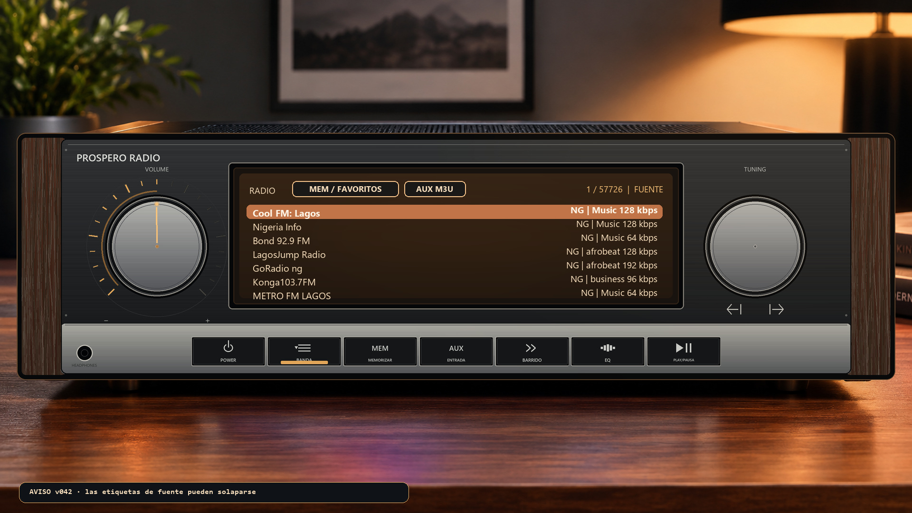
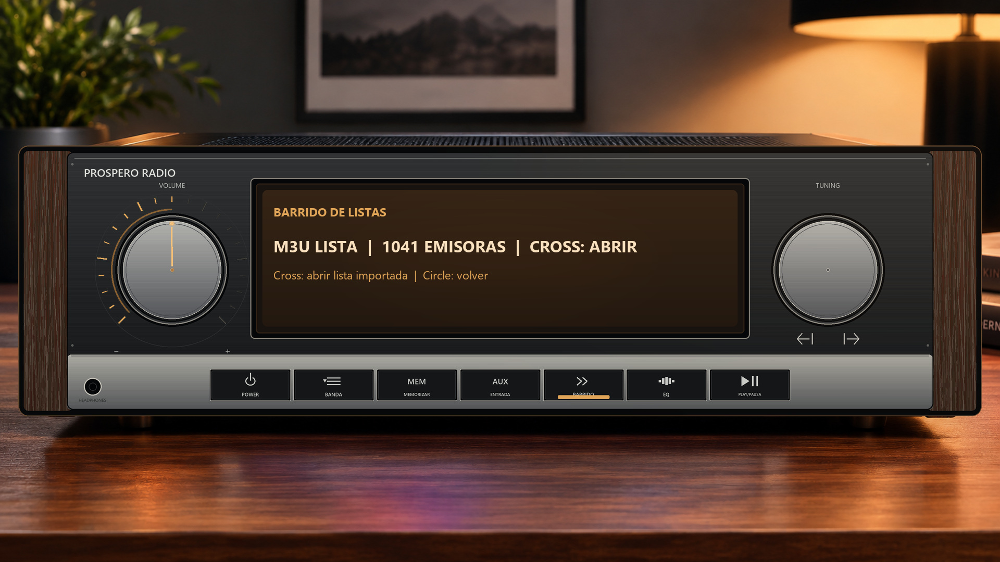
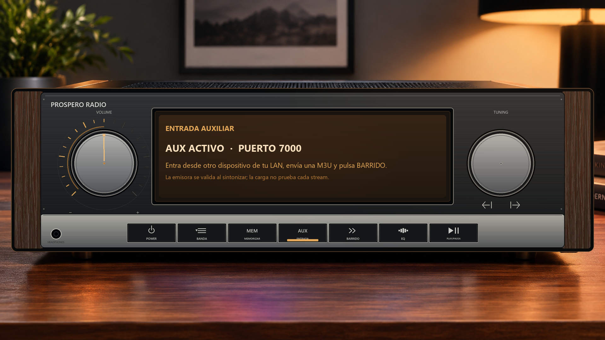
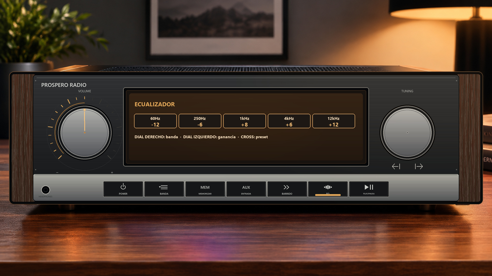
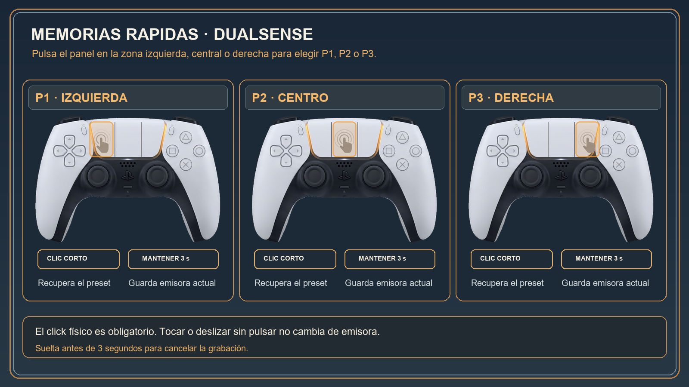

# Manual de usuario — Prospero Radio 01.000.046

## Qué muestra este manual

Las pantallas son composiciones hechas con la fachada y los atlas de controles
del proyecto. No son capturas de una PS5. Los nombres y valores se contrastaron
con las fotos y observaciones de consola disponibles hasta la v046; las
ilustraciones siguen siendo material gráfico, no capturas de PS5.

## Controles del receptor

| Control | Acción |
| --- | --- |
| POWER | Inicia la secuencia de apagado y cierra la radio. |
| BANDA | Abre la lista de emisoras de Radio Browser. |
| MEM | Abre la lista de emisoras guardadas como favoritas. |
| AUX | Activa el servidor local para recibir una lista M3U. |
| BARRIDO | Lee la M3U recibida; pulsa **✕** para abrir sus emisoras. |
| EQ | Abre el ecualizador de doce bandas con faders L/R. |
| PLAY/PAUSA | Inicia o detiene la reproducción. |
| Dial/joystick izquierdo | Ajusta el volumen; dentro de EQ modifica la ganancia de la banda seleccionada. |
| Dial/joystick derecho | Cambia de emisora; dentro de EQ selecciona la banda. |

En las listas, usa **↑/↓** para mover la selección, **✕** para sintonizar,
**□** para añadir o quitar una emisora de Favoritos y **○** para volver. Usa
**←/→** para alternar entre Radio, Favoritos y AUX M3U. Las etiquetas de esas
fuentes pueden aparecer vacías o solapadas en v042; la navegación sigue teniendo
esas tres fuentes aunque el rótulo no se vea bien. El usuario informa que en
v046 no observa los problemas visuales anteriores; no se documentó una revisión
por separado de cada pantalla.

En la lista AUX, **mantén □ durante 3 segundos** para eliminar la emisora
seleccionada; aparece una cuenta atrás y soltar antes cancela el borrado. Este
gesto está en v046, pero su comprobación específica en hardware sigue pendiente.

Una emisora que aparece en una lista AUX aún no está necesariamente conectada.
La fuente de v046 incluye lectura de M3U/M3U8, PLS, XSPF y ASX y filtra URLs
HTTP(S), pero la matriz de formatos y codificaciones sigue pendiente de
validación específica en PS5. Comprueba el stream cuando se sintoniza; el usuario
reporta problemas en algunos HLS y ruido blanco en el test DASH 06.

## Importar una lista AUX desde la red local

1. En la radio, abre **AUX** y deja activa la pantalla del servidor.
2. Desde un dispositivo conectado a la misma red, visita
   `http://IP-DE-LA-CONSOLA:7000/`.
3. Elige un fichero `.m3u`, `.m3u8`, `.pls`, `.xspf` o `.asx` y envíalo.
   También puedes pegar el contenido de una lista. La página confirma la recepción.
4. Vuelve a la radio y pulsa **BARRIDO**. Cuando aparezca el número de emisoras,
   pulsa **✕** para abrir la fuente AUX M3U.
5. Selecciona una emisora y pulsa **✕** para intentar reproducirla.

La importación admite M3U, M3U8, PLS, XSPF y ASX, con una carga de hasta 4 MiB.
El servidor no tiene contraseña:
úsalo solo dentro de una red local de confianza. BARRIDO no certifica que todas
las URLs respondan; eso solo se sabe al intentar sintonizarlas.

## Ecualizador

EQ presenta doce bandas y controles de ganancia independientes para L/R. Usa la
interfaz para seleccionar el control y modificar el nivel. Los presets recorren
curvas de banda; el formato EQ2 persiste las doce ganancias y ambos faders.
La lista exacta de frecuencias se muestra en el ecualizador.

## Tres memorias rápidas del panel táctil

El área se divide en tres zonas: izquierda **P1**, centro **P2** y derecha
**P3**. El click físico del panel es obligatorio; tocar o deslizar sin pulsar no
cambia de emisora. La zona queda fijada al iniciar el click.

- **Click corto** en una zona: recupera su emisora memorizada. Si está vacía, la
  pantalla indica que no hay preset.
- **Mantén el panel pulsado 3 segundos** en una zona: guarda allí la emisora
  actual. Suelta antes y la grabación se cancela.
- La barra luminosa del DualSense comunica la memoria con pulsos ámbar; la
  cantidad identifica P1, P2 o P3.

La ilustración siguiente parte del render del DualSense elegido para esta guía;
las zonas y acciones se han rotulado para reflejar el funcionamiento de la radio.

## Estado conocido de la v046

- El usuario informa que la app se mantiene ágil, reconoce su configuración
  previa en `/data/radio` y permite recorrer la lista manteniendo ↑/↓.
- El test DASH 06 produce ruido blanco; no se reportó crash en esta prueba.
  Algunos streams HLS siguen fallando. No se debe interpretar como compatibilidad
  DASH/HLS confirmada.
- AUX sigue pendiente de pruebas específicas de formatos, persistencia de edición
  y borrado de una fila con Cuadrado mantenido 3 segundos.

La detección de auriculares del DualSense queda fuera del alcance del proyecto.
Las capturas históricas de v042 pueden mostrar `JACK N/A`; esa etiqueta no
representaba una lectura confirmada del conector y se retiró del código fuente.

El registro de tareas y su evidencia está en [`PENDIENTES.md`](PENDIENTES.md).
La guía de mandos y atlas está en [`RADIO-CONTROLS-ATLAS.md`](RADIO-CONTROLS-ATLAS.md)
y el flujo técnico del servidor en [`PUENTE-PAYLOAD.md`](PUENTE-PAYLOAD.md).
